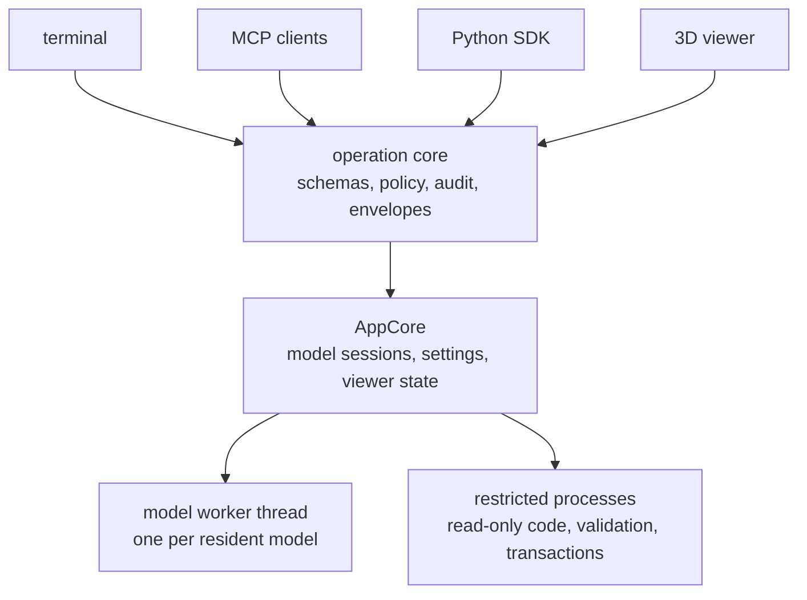
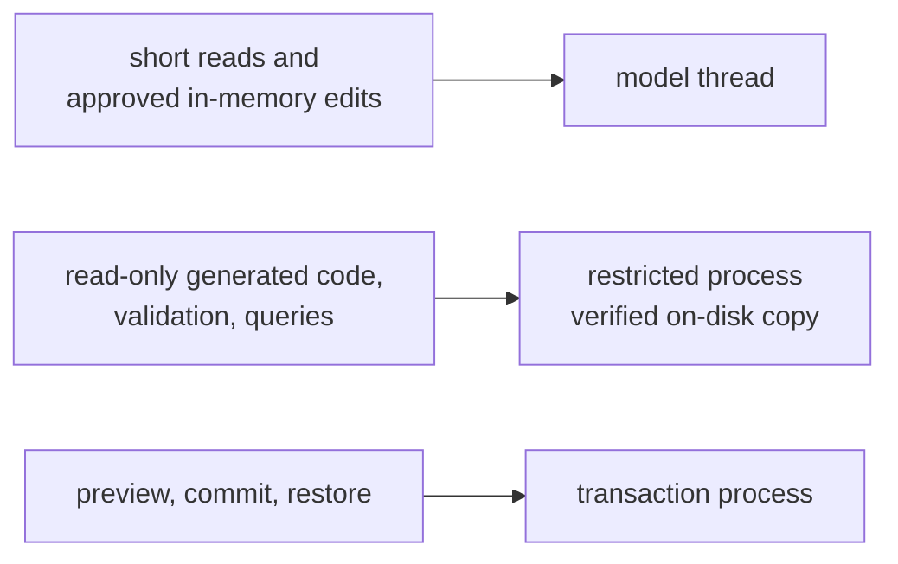
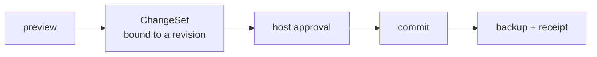

# Architecture

Every interface calls the same operations. There is one implementation of
each IFC behavior, one policy check, and one response shape.

## Two packages

| Package | Owns |
| :--- | :--- |
| `ifc-console` | terminal, MCP server, SDK, IFC operations, jobs and workflows, the viewer |
| `ifc-console-agents` | provider chat, agent packs, the Agent panel, document ingestion |

The agents package plugs in through the `ifc_console.extensions` entry point.
Core never imports it, so everything in core works without an LLM.

## The operation contract

Operations register once. Every interface gets the same input schema, the
same capability requirements, the same ask/edit policy decision, and the same
`{ok, data | error, meta}` envelope. Mode changes, approvals, and allowed
paths are host actions and are never exposed as tools.

## Model access

IfcOpenShell file objects are not thread-safe, so each resident model has one
worker thread and every access is serialized through it. One model is active
and writable; attached models are read-only.

## Structured changes

AI tools can preview and inspect a ChangeSet. Approving and committing are
SDK or CLI actions. Commit rechecks the revision and source hash, validates a
reopened candidate, and replaces the file under a lock.

## Runtime

The terminal (Textual) and the HTTP server (Uvicorn) share one asyncio loop.
Operation handlers send IFC access to model threads; long validation, code
runs, and transactions use supervised subprocesses. Results return to the
loop and update the console and every connected browser tab.

The viewer is plain browser modules plus Three.js and web-ifc, shipped inside
the package. It makes no requests outside localhost. When the agents package
is installed, its panel's JavaScript and CSS load only when you open it.
