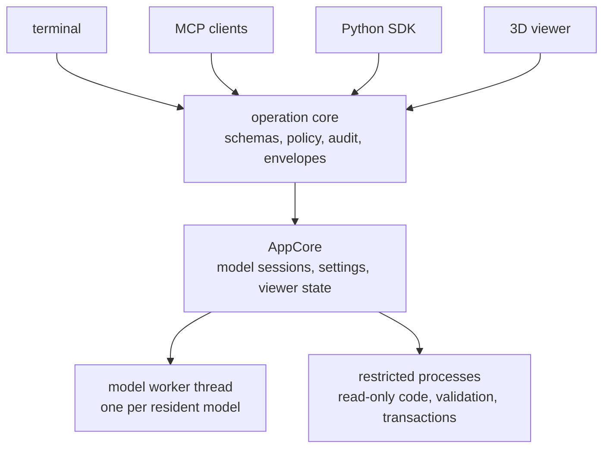
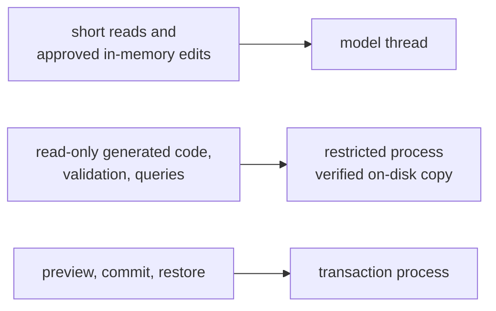

# Architecture

Every interface calls the same operations. There is one implementation of
each IFC behavior, one policy check, and one response shape.

```mermaid
flowchart TB
    tui["terminal"] --> ops
    mcp["MCP clients"] --> ops
    sdk["Python SDK"] --> ops
    viewer["3D viewer"] --> ops
    ops["operation core<br/>schemas, policy, audit, envelopes"] --> core["AppCore<br/>model sessions, settings, viewer state"]
    core --> model["model worker thread<br/>one per resident model"]
    core --> workers["restricted processes<br/>read-only code, validation, transactions"]
```

## One package, two layers

| Module | Owns |
| :--- | :--- |
| `ifc_console` | terminal, MCP server, SDK, IFC operations, jobs and workflows, the viewer |
| `ifc_console.agents` | provider chat, agent packs, workflows in chat, the Agent panel, engines, skills |

`ifc_console.agents` plugs in as a built-in extension: it is imported only when
the console attaches it, never by `import ifc_console`. If it fails to load, the
console, MCP server, SDK, and viewer keep working. Third-party extensions use the
`ifc_console.extensions` entry point. The `[agents]` extra adds libraries that
talk to the outside (ACP engines, the system keyring, PDF); the Agent workspace
itself runs on the base install.

## The operation contract

Operations register once. Every interface gets the same input schema, the
same capability requirements, the same ask/edit policy decision, and the same
`{ok, data | error, meta}` envelope. Mode changes, approvals, and allowed
paths are host actions and are never exposed as tools.

## Model access

IfcOpenShell file objects are not thread-safe, so each resident model has one
worker thread and every access is serialized through it. One model is active
and writable; attached models are read-only.

One gate sits above the model threads. Work on a model (queries, viewer
requests, edits, saves, read-only code runs) holds it shared, so those overlap.
Changing which models are loaded (opening, switching, detaching, committing a
ChangeSet) holds it exclusive and waits for shared work to finish. A large file
parses outside the gate: the current model keeps answering, and only the swap at
the end is exclusive. Edits and saves also take a per-model lock, so they run one
at a time. A call that arrives while the first model is still loading waits up to
20 seconds, then answers `MODEL_BUSY`.

```mermaid
flowchart LR
    read["short reads and<br/>approved in-memory edits"] --> thread["model thread"]
    code["read-only generated code,<br/>validation, queries"] --> restricted["restricted process<br/>verified on-disk copy"]
    tx["preview, commit, restore"] --> txproc["transaction process"]
```

## Structured changes

```mermaid
flowchart LR
    preview["preview"] --> cs["ChangeSet<br/>bound to a revision"] --> approve["host approval"] --> commit["commit"] --> receipt["backup + receipt"]
```

AI tools can preview and inspect a ChangeSet. Approving and committing are
SDK or CLI actions. Commit rechecks the revision and source hash, validates a
reopened candidate, and replaces the file under a lock.

## Runtime

The terminal (Textual) and the HTTP server (Uvicorn) share one asyncio loop.
Operation handlers send IFC access to model threads; long validation, code
runs, and transactions use supervised subprocesses. Results return to the
loop and update the console and every connected browser tab.

The viewer is plain browser modules plus Three.js and web-ifc, shipped inside
the package. It makes no requests outside localhost. The Agent panel's
JavaScript and CSS load only when you open it.
