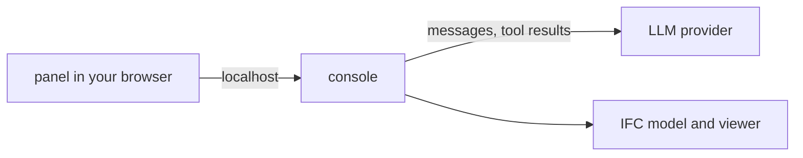

# Agent workspace

The Agent workspace is an optional browser panel from `ifc-console-agents`.
It sits beside the 3D viewer, chats with a provider of your choice, and is the
only part of ifc-console that can contact an LLM. It is off by default.

## Install and open

```bash
uv tool install --with ifc-console-agents ifc-console
# or: pip install ifc-console-agents
```

| Command | Action |
| :--- | :--- |
| `/agent` | open the General assistant beside the viewer |
| `/agent <name>` | open a named assistant |
| `/agent list` | list built-in and custom assistants |
| `/agent new` | build a custom assistant |
| `/agent off` | close the workspace and forget any in-memory key |

`/viewer` always opens the viewer alone. `/agent` attaches the panel to that
same viewer, so it sees the same selection, sections, and measurements.

## Providers

| Provider | Credential | Notes |
| :--- | :--- | :--- |
| OpenAI | `OPENAI_API_KEY` | models available to the account |
| Anthropic | `ANTHROPIC_API_KEY` | native Claude tool use |
| OpenRouter | `OPENROUTER_API_KEY` | models from several providers |
| Local | none | any OpenAI-compatible server |

Pick the provider and model in **Models**. A key is looked up in this order:
pasted into the panel, stored with `ifc-console keys set <provider>`, then the
environment variable. Pasted keys stay in memory; stored keys never reach the
browser.



The console sends the provider your messages, instructions, images, and tool
results, which may contain model data. Use a local provider or keep the
workspace off when that data must not leave the machine.

## Assistants

| Assistant | Purpose |
| :--- | :--- |
| General | the full IFC, document, measurement, and review surface |
| Measurement | cited, recipe-driven measurements |
| Documents | answers from indexed project references |
| Model review | schema, IDS, clashes, quantities, and model health |

Each assistant keeps its own conversation and tool limits. Custom assistants
choose from reviewed capability blocks and cannot widen policy.

## Composer

- ++enter++ sends, ++shift+enter++ adds a line, **Stop** cancels.
- `@` offers workflows, the 3D selection, saved views, and project files.
  `#` offers saved skills. `/` offers panel commands.
- Selecting elements in the viewer adds their GlobalIds to the next message,
  so "this wall" resolves without another round.
- GlobalIds in answers are links that select and frame the element.
- **Content** adds manuals, drawings, and photos as reference material; the
  paperclip attaches evidence to one message only.

## Tools and safety

The panel follows the session's ask/edit mode. Two controls are independent:

| | Approval | Auto |
| :--- | :--- | :--- |
| **Ask** | read-only, pauses before protected calls | read-only, no pauses |
| **Edit** | may change memory, pauses before protected calls | may change memory without pausing |

A protected call waits as a row with **Deny** and **Approve**. In edit mode
the assistant works in the same copy the console made; it can never write the
file you opened. Every tool call appears in the transcript with its arguments
and result. See [Safety](safety.md).

## Settings

| Key | Default | Purpose |
| :--- | :--- | :--- |
| `chat.provider` | `openai` | initial provider |
| `chat.model` | empty | initial model ID |
| `chat.base_url` | empty | provider URL override, for local servers |
| `chat.local_only` | `false` | refuse non-local provider URLs |
| `chat.max_tool_rounds` | `8` | tool rounds per answer |
| `chat.timeout_s` | `300` | provider timeout |

`ifc-console --agent` opens the workspace at startup.
