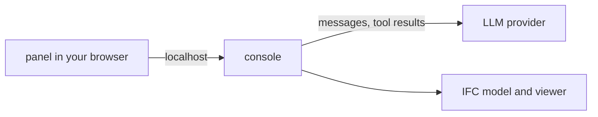

# Agent workspace

The Agent workspace is a browser panel that ships with ifc-console. It sits
beside the 3D viewer, chats with a provider of your choice, and is the only
part of ifc-console that can contact an LLM. It is off by default.

## Install and open

The workspace runs on the base install. Add the `[agents]` extra for agent
engines (ACP), keyring storage of provider keys, and PDF support:

```bash
uv tool install "ifc-console[agents]"
# or: pip install "ifc-console[agents]"
```

| Command | Action |
| :--- | :--- |
| `/agent` | open the General assistant beside the viewer |
| `/agent <name>` | open a named assistant |
| `/agent list` | list the assistants |
| `/agent off` | close the workspace and forget any in-memory key |

`/viewer` always opens the viewer alone. `/agent` attaches the panel to that
same viewer, so it sees the same selection, sections, and measurements.

## Providers

| Provider | Credential | Notes |
| :--- | :--- | :--- |
| OpenAI | `OPENAI_API_KEY` | models available to the account |
| Anthropic | `ANTHROPIC_API_KEY` | native Claude tool use |
| OpenRouter | `OPENROUTER_API_KEY` | models from several providers |
| Local | none | any OpenAI-compatible server |

Pick the provider and model in the [Settings dialog](#settings-dialog). A key
is looked up in this order: pasted into the panel, stored with
`ifc-console keys set <provider>`, then the environment variable. Pasted keys
stay in memory; stored keys never reach the browser.


```mermaid
flowchart LR
    browser["panel in your browser"] -- localhost --> console["console"]
    console -- "messages, tool results" --> provider["LLM provider"]
    console --> model["IFC model and viewer"]
```

The console sends the provider your messages, instructions, images, and tool
results, which may contain model data. Use a local provider or keep the
workspace off when that data must not leave the machine.

An external agent (OpenCode, Codex CLI, Goose, Gemini CLI) can take the place
of the provider and the console's tool loop: see [Agent engines](engines.md).

## Assistants

| Assistant | Purpose |
| :--- | :--- |
| General | the full IFC, document, measurement, and review surface |
| Measurement | cited, recipe-driven measurements |
| Documents | answers from indexed project references |
| Model review | schema, IDS, clashes, quantities, and model health |

Each assistant keeps its own conversation and tool limits and cannot widen
policy. Every conversation belongs to an assistant; General is the default.

The gear in the header opens the workspace. It has three tabs: **Assistant**
(choose an assistant and see what it can do), **Content** (manuals, drawings,
and photos the assistants may search), and **Skills** (saved procedures).

## Composer

The message box has four controls: `+`, the model name, the **Ask** or **Edit**
choice, and **Send**, which becomes **Stop** while a response runs.

- ++enter++ sends, ++shift+enter++ adds a line, ++esc++ stops a running
  response.
- `@` offers workflows, the 3D selection, saved views, and project files.
  `#` offers saved skills. `/` offers panel commands.
- Selecting elements in the viewer adds their GlobalIds to the next message,
  so "this wall" resolves without another round.
- GlobalIds in answers are links that select and frame the element.
- **Content** adds manuals, drawings, and photos as reference material; the
  **Attach a file** row in the `+` menu attaches evidence to one message only.

### The + menu

- **Add to this message**: attach a file, attach the current 3D view, mention
  project content, run a workflow, and work with the 3D selection.
- **Skills**: tick a skill to follow it with every message until you untick
  it. Typing `#` does the same.
- **Session**: **Run tools without asking** switches between Approval and Auto
  and asks you to confirm before Auto turns on. While Auto is on, the Ask or
  Edit choice shows an **Auto** tag. **Free memory** shows what this page and
  the console hold and releases parsed models and old tool output. When memory
  is high, a dot appears on `+` and a line appears under the message box.
- **IFC model**: appears when several models are attached. Pick the one to
  show in the 3D view.
- **Settings** and **Keyboard shortcuts**.

## Settings dialog

The dialog holds the provider, model, and key under **Models**, and the theme,
saved conversations, and optional feature status under **App**. Click the
model name or choose **Settings** in the `+` menu, or type `/model`. Press
++esc++ or **Save settings** to close it.

## Tools and safety

The panel follows the session's ask/edit mode. Two controls are independent:

| | Approval | Auto |
| :--- | :--- | :--- |
| **Ask** | read-only, pauses before protected calls | read-only, no pauses |
| **Edit** | may change memory, pauses before protected calls | may change memory without pausing |

A protected call waits as a row with **Deny** and **Approve**. In edit mode
the assistant works in the same copy the console made; it can never write the
file you opened. Every tool call appears in the transcript with its arguments
and result. See [Safety](safety.md).

## Settings

| Key | Default | Purpose |
| :--- | :--- | :--- |
| `chat.provider` | `openai` | initial provider |
| `chat.model` | empty | initial model ID |
| `chat.base_url` | empty | provider URL override, for local servers |
| `chat.local_only` | `false` | refuse non-local provider URLs |
| `chat.timeout_s` | `300` | provider timeout |

`ifc-console --agent` opens the workspace at startup.
