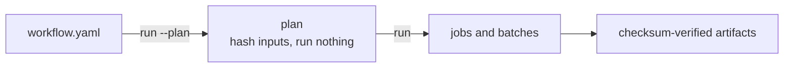

# CLI and settings

Run `ifc-console` with no arguments for the interactive console. Subcommands
cover servers, CI, automation, and administration. `ifc-console <command> --help`
shows the exact options of your installed version.

## Common commands

| Goal | Command |
| :--- | :--- |
| open the console | `ifc-console` |
| check the installation | `ifc-console doctor --file model.ifc` |
| validate a model in CI | `ifc-console check model.ifc --ids rules.ids --format sarif` |
| print a client setup | `ifc-console mcp-config --client codex` |
| headless HTTP server with viewer | `ifc-console --no-tui --file model.ifc --viewer` |
| private stdio server for one client | `ifc-console serve --stdio --file model.ifc` |
| inspect settings | `ifc-console settings list --sources` |
| rotate the local token | `ifc-console token rotate` |

## Startup flags

| Flag | Effect |
| :--- | :--- |
| `--file PATH` | open a model at startup |
| `--mode ask\|edit` | starting mode |
| `--port N` | HTTP port, default `8383` |
| `--viewer` | enable the viewer at startup |
| `--agent` | open the Agent workspace; needs `ifc-console-agents` |
| `--allow-dir PATH` | add a readable folder; repeatable |
| `--no-tui` | run the HTTP server without the terminal UI |
| `--log-level LEVEL` | `debug`, `info`, `warning`, or `error` |

## Automation



```bash
ifc-console run workflow.yaml --plan --json
ifc-console run workflow.yaml --output-dir reports
ifc-console workflows list | watch <id> | resume <id>

ifc-console batch validate models/*.ifc --concurrency 4
ifc-console batch query models/*.ifc --selector IfcWall --format jsonl

ifc-console jobs validate model.ifc --ids rules.ids --output-dir reports
ifc-console artifacts list
```

Runs and resumes refuse changed source files. A manifest example is in the
[SDK guide](sdk.md#batch-workflows).

## Structured changes

```bash
ifc-console changes preview model.ifc --global-id 2abc... \
  --pset Pset_WallCommon --property FireRating --value F60
ifc-console changes approve sha256:CHANGESET --by bim-manager
ifc-console changes commit model.ifc sha256:CHANGESET --approval sha256:APPROVAL
ifc-console changes restore model.ifc sha256:COMMIT --confirm
```

Preview never changes the model. Commit makes a backup and replaces the file
under a lock.

## Administration

| Command | Use |
| :--- | :--- |
| `settings list\|get\|set\|unset` | user settings |
| `token show\|rotate` | the local bearer token |
| `sessions list\|show\|verify` | audit sessions |
| `recents list\|clear` | recently opened models |
| `knowledge build\|status\|search` | the offline IFC reference index |
| `keys set\|list\|delete` | provider keys in the system keyring; needs `ifc-console-agents` |

## Exit codes

| Code | Meaning |
| :--- | :--- |
| `0` | success |
| `1` | runtime or automation failure |
| `2` | environment, dependency, or policy problem |
| `3` | invalid usage or no terminal |
| `4` | file missing or unreadable |
| `5` | validation ran and findings failed the check |

## Settings

Defaults are safe. Change a setting from the shell or the console:

```bash
ifc-console settings set sandbox.mode strict
```

```text
/settings sandbox.mode strict
```

User data lives under `~/.ifc-console/` (or `IFC_CONSOLE_HOME`): settings,
the token, backups, working copies, jobs, audit sessions, and logs. Settings
apply in this order, last wins:

```text
defaults < user file < project file < environment < CLI
```

A project `.ifc-console/settings.json` may only set `tui.theme`, so a cloned
repository cannot weaken your permissions. Any setting can be overridden for
one process with `IFC_CONSOLE_<SECTION>_<KEY>`, for example
`IFC_CONSOLE_SERVER_PORT=9000`.

### The ones that matter

| Key | Default | Meaning |
| :--- | :--- | :--- |
| `mode.default` | `ask` | startup mode |
| `server.port` | `8383` | HTTP port for MCP and the viewer |
| `sandbox.mode` | `auto` | `auto`, `strict`, or `off` for read-only generated code |
| `exec.timeout_seconds` | `30` | time limit for one read-only code run |
| `files.allowed_dirs` | `[]` | extra readable folders |
| `files.allow_ai_save` | `false` | let AI tools write the file you opened |
| `files.working_copy` | `true` | edit mode works in a copy |
| `workspace.max_resident` | `3` | models held in memory |
| `viewer.max_model_mb` | `200` | largest model sent to the browser |
| `chat.provider` | `openai` | Agent workspace provider |
| `chat.local_only` | `false` | refuse non-local provider URLs |
| `tui.theme` | `blue` | `light`, `dark`, `modern`, or `blue` |

`ifc-console settings list` prints every key with its current value and
source.
