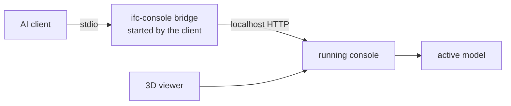

# Connect a client

Connect each AI client once. After that it always sees the model that is open
in your console, and every call it makes shows up in the console feed.

## Quick setup

1. Start `ifc-console`.
2. Run `/connect` and pick your client, or `/connect codex` directly.
3. Paste the configuration where the console says. If copying to the
   clipboard fails, copy the printed text by hand.
4. Restart or reload the client once.
5. Ask it: **Use ifc-console to report the active model and the viewer selection.**

The same output is available outside the console:

```bash
ifc-console mcp-config --client codex
```

Client names are `claude-code`, `claude-desktop`, `cursor`, `vscode`, and
`codex`.

## How it connects



The client starts a small bridge process that forwards to the console. That
is why the client and the console can start in either order, why several
clients share one model and one mode switch, and why the client configuration
holds no IFC path and no token. The token lives in `~/.ifc-console/token`;
regenerate client setups only after `ifc-console token rotate` or a port
change.

## Per client

### Claude Code

Run the command that `/connect claude-code` prints:

```bash
claude mcp add --scope user ifc-console -- /path/to/ifc-console bridge
```

### Claude Desktop

**Settings > Developer > Edit Config**, then add to `claude_desktop_config.json`:

```json
{
  "mcpServers": {
    "ifc-console": {
      "command": "/path/to/ifc-console",
      "args": ["bridge"]
    }
  }
}
```

### Cursor

Add to `~/.cursor/mcp.json`:

```json
{
  "mcpServers": {
    "ifc-console": {
      "command": "/path/to/ifc-console",
      "args": ["bridge"]
    }
  }
}
```

### VS Code

Run **MCP: Open User Configuration** from the Command Palette and add:

```json
{
  "servers": {
    "ifc-console": {
      "type": "stdio",
      "command": "/path/to/ifc-console",
      "args": ["bridge"]
    }
  }
}
```

For the Codex extension inside VS Code, use the Codex setup below instead.

### Codex

Add to `~/.codex/config.toml`:

```toml
[mcp_servers.ifc-console]
command = "/path/to/ifc-console"
args = ["bridge"]
```

The desktop app, CLI, and IDE extension share this file. Replace any older
entry that contains `bearer_token_env_var`; the bridge needs no token there.

## Working with the viewer from a client

Open the viewer with `/viewer`, select an element, and ask the client about
"the selected wall". It reads your selection with `get_viewer_selection`,
can highlight or section the scene with `control_viewer`, and can take a
`get_viewer_screenshot` to look at the result. In VS Code, `/viewer vscode`
prepares a link for the built-in browser so the viewer sits beside the chat.

To catalogue parameters from a PDF: attach the PDF in the client's own chat,
select the element in the viewer, and ask the client to extract the values,
explain them with sources, and show the evidence in the viewer before
requesting any change.

## Other transports

| Transport | Use it when | Trade-off |
| :--- | :--- | :--- |
| `bridge` (default) | you want the shared console and any start order | one small proxy per client |
| `http` | the console always starts first | the configuration may contain a token |
| `stdio` | one client should own its own server | no shared `/file`, feed, or viewer |

```bash
ifc-console mcp-config --client <client> --transport http
ifc-console mcp-config --client <client> --transport stdio --file model.ifc
```

!!! warning "Keep HTTP tokens private"
    Do not commit a direct HTTP configuration. If a token leaks, run
    `ifc-console token rotate` and regenerate the setup.

Connection problems are covered in [Troubleshooting](troubleshooting.md).
