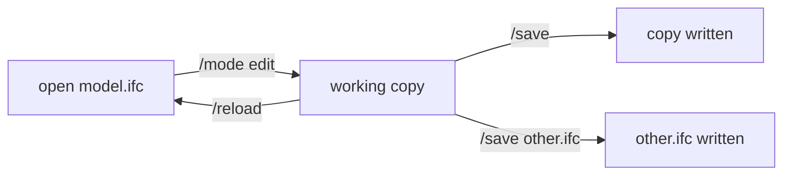

# The console

Run `ifc-console` with no arguments to open the terminal. It owns the model,
the ask/edit switch, the MCP endpoint, and the viewer. Chat happens in your AI
client or the optional [Agent workspace](chat.md).

```text
+------------------------------------------------------------+
| model.ifc | IFC4 | MODE: ASK | MCP 127.0.0.1:8383          |
|                                                            |
| 14:02:11  ok  get_ifc_project_info  212ms                  |
| 14:02:19  ok  query_elements           48ms                |
|                                                            |
| > /mode _                                                  |
+------------------------------------------------------------+
```

- **Status bar:** model, mode, unsaved changes, endpoint, viewer.
- **Feed:** server events and every AI operation.
- **Prompt:** slash commands with completion.

## Keys

| Key | Action |
| :--- | :--- |
| ++tab++ | insert a completion |
| ++up++ / ++down++ | move through choices or history |
| ++enter++ | select or run |
| ++escape++ | close the menu or clear the line |
| ++page-up++ / ++page-down++ | scroll the feed |
| ++ctrl+l++ | clear the feed |
| ++ctrl+c++ | copy the selected feed text, or exit with nothing selected |

Type `/` to browse commands. Unique prefixes work, so `/stat` runs `/status`.

## Commands

### Models

| Command | Use |
| :--- | :--- |
| `/file [path]` | pick or open the active model |
| `/workspace [dir]` | browse a folder and attach related files |
| `/attach <path>` / `/detach <id>` | add or remove a read-only model or companion file |
| `/use <id>` | make an attached model the active one |
| `/models` | list resident models and attachments |
| `/info` | entity counts for the active model |
| `/save [path]` / `/reload` | keep or discard changes |

### Session and browser

| Command | Use |
| :--- | :--- |
| `/mode [ask\|edit]` | show or change what the AI may do |
| `/sandbox [auto\|strict\|off\|restart]` | control generated-code isolation |
| `/viewer [browser\|vscode]` | open the 3D viewer, or prepare a link for VS Code's browser |
| `/agent [name\|new\|list\|off]` | open the optional Agent workspace |
| `/connect [client\|all]` | print a client's setup |
| `/copy [client\|url\|viewer\|token]` | copy connection data |
| `/port <n>` | move the HTTP server |
| `/theme [light\|dark\|modern\|blue]` | change the console and viewer theme |

### Help and diagnostics

| Command | Use |
| :--- | :--- |
| `/status` | model, revision, selection, save destination |
| `/tools [section]` | inspect AI tools, prompts, resources, or settings |
| `/kb [query]` | search the offline IFC reference |
| `/settings [key value]` | inspect or change settings |
| `/audit [n]` | show recent audit records |
| `/help [command]` | show help |
| `/clear` / `/quit` | clear the feed or exit |

## Files

Start the console in your model folder. `/file` lists recent models and the
IFC files in that folder and one level below. Type part of a name to filter,
or paste a path (quoted if it has spaces). ++ctrl+l++ clears the filter.

Most sessions need one model. For coordination work:

```text
> /workspace C:/models/project
> /attach structural.ifc
> /attach requirements.ids
> /models
```

Only the active model is writable. Attached IFC models are read-only; IDS,
BCF, and CSV files are companions that tools can read.

## Edit and save



`ask` is read-only. `/mode edit` copies the open file aside and allows changes
in memory; the status bar then reads *working in a copy*. `/save` writes that
copy, `/save <path>` writes anywhere else, and `/reload` discards. The file you
opened is never written unless you name it yourself. `/status` always shows
where the next save goes.

`/quit` and ++ctrl+q++ exit and warn about unsaved changes.
