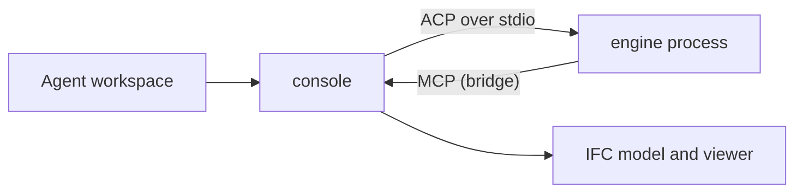

# Agent engines

The Agent workspace normally runs its own tool loop against a model provider.
An **engine** replaces that loop with an external agent that speaks the
[Agent Client Protocol](https://agentclientprotocol.com) (ACP): OpenCode,
Codex CLI, Claude Code, Goose or Gemini CLI. The engine brings its model
routing, context management and skills; the console keeps the IFC tools, the
mode gate, the working copy, the transcript and the audit log.



Engines are off by default. Nothing is spawned until you enable one.

## Enable an engine

```bash
ifc-console agents engines list              # known engines and whether they are installed
ifc-console agents engines enable opencode   # or codex, claude, goose, gemini
```

Then click the model pill in the composer to open Settings and pick
**OpenCode (engine)** under **Provider**. The model select shows `default`: the engine chooses
the model from its own configuration (`opencode.json`, `~/.codex/config.toml`,
and so on). Keys are the engine's business too; the console forwards
`OPENAI_API_KEY`, `ANTHROPIC_API_KEY` and `OPENROUTER_API_KEY` from the
keyring or the environment to the engine process.

Known engines and how they are started:

| Engine | Command | Notes |
| :--- | :--- | :--- |
| OpenCode | `opencode acp` | MIT. Its agent files appear as ACP modes, so `--mode ifc` picks one |
| Codex CLI | `npx -y @agentclientprotocol/codex-acp` | Apache-2.0 through the codex-acp adapter; needs Node |
| Claude Code | `npx -y @zed-industries/claude-agent-acp` | through the claude-agent-acp adapter; needs Node |
| Goose | `goose acp` | Apache-2.0 |
| Gemini CLI | `gemini --acp` | Apache-2.0 |

Any other ACP agent works with `--command` and `--arg`:

```bash
ifc-console agents engines enable mine --command my-agent --arg=--acp --mode review
```

## What the engine sees

Each panel conversation gets one engine process. The console opens an ACP
session with a scratch folder under `~/.ifc-console/agents/harness/runs/` as
the working directory and hands the engine one MCP server: this console,
through `ifc-console bridge`. The first prompt of the session starts with the
assistant's composed instructions (role, rules, the skill index, your project
instructions) and the rule to use the `ifc-console` tools for anything about
the model. Later prompts on the same conversation are sent as typed. An
engine that was idle for `idle_timeout_s` (10 minutes by default) is stopped;
the next prompt starts a fresh one with a short recap of the conversation.

The engine's tool calls render as the usual tool cards; a call to a console
tool shows the console's `{ok, data, meta}` result. When the engine asks for
permission (its own shell, a file edit, a tool it does not trust yet), the
panel shows the approval card and your answer goes back as the engine's
allow-once or reject-once option. **Stop** cancels the engine's turn.

## Authority

The engine holds the same authority as any MCP client of the console: the
session mode decides. In ask mode the model is read-only; in edit mode changes
go to the working copy; approve, commit and mode changes are never exposed.
Two panel features do not apply to engine runs yet: the per-call approval for
console tools (`execute_ifc_code` runs without a card in edit mode) and the
per-assistant content access selection (the engine can search the whole
reference library). Both come with a run-scoped tool proxy in a later release.

The engine's own tools (shell, file edits, web) are governed by the engine's
permission configuration. The scratch working directory keeps its file tools
away from your project unless you set `cwd: project` on the engine. Keep the
engine's configuration restrictive; for OpenCode an agent file such as

```markdown
---
description: IFC work through the ifc-console MCP tools, read-only on disk
mode: primary
permission:
  edit: deny
  bash: ask
  webfetch: deny
---
Use the ifc-console tools for every question about the model. Never write files;
proposals go through the propose_* tools and a person commits.
```

and `--mode ifc` on the engine is a good default. Model text reaches an agent
with a shell, so the same care applies as with any agent that reads untrusted
files. Every spawn is recorded in the audit log with its command line.

## Settings

`harness.enabled` turns engines on. `harness.engines` is a list; each entry
has `name`, `command`, `args`, `env`, `cwd` (`run`, `project` or `home`),
`mcp` (`bridge`, or `http` for engines that support HTTP MCP servers),
`mode`, `instructions` (`prompt`, `file`, `both` or `none`),
`instructions_file`, `local` and `idle_timeout_s`. `harness.keep_run_dirs`
bounds the scratch folders kept for debugging (each holds
`engine.stderr.log`). Engines are user settings only; a project's
`.ifc-console/settings.json` cannot add one. With `chat.local_only` on, only
engines marked `local: true` may run, because the console cannot see where an
engine sends the prompt.

Workflows can name an engine on an agent step:

```yaml
  - kind: agent
    id: audit
    engine: opencode
    preset: measurement
    prompt: "Audit the beams against the spec."
```

A workflow run started from the panel with an engine provider selected runs
every agent step on that engine.
