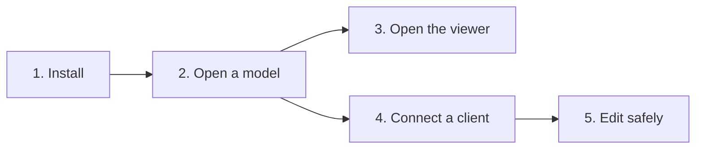
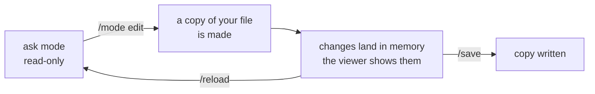

# Getting started

Everything on this page works without an LLM. Connecting an AI client is one
optional step at the end.



## Requirements

- Python 3.10 to 3.14 on Windows, macOS, or Linux.
- Optionally, an MCP client such as Claude, Cursor, VS Code, or Codex.

## 1. Install

| Package | What it gives you |
| :--- | :--- |
| `ifc-console` | terminal, MCP server, Python SDK, IFC operations, and the 3D viewer |
| `ifc-console-agents` | adds the optional Agent workspace: provider chat and agent packs |
| `ifc-console[validation]` | adds IDS validation |

```bash
uv tool install ifc-console
# or: pip install ifc-console
```

Check the installation:

```bash
ifc-console doctor
```

!!! note "Working on the source?"
    Clone the repository, run `uv sync --all-packages --all-extras`, then use
    `uv run --all-packages --all-extras ifc-console`. See
    [Contributing](contributing.md).

## 2. Open a model

Start in the folder that holds your IFC files:

```bash
cd path/to/your/models
ifc-console
```

Then choose a file:

```text
> /file
```

`/file` lists recent models and the IFC files in the current folder. Type to
filter, or paste a full path. `ifc-console --file model.ifc` opens one at
startup.

| Command | Purpose |
| :--- | :--- |
| `/file` | open or switch the active model |
| `/status` | model, mode, unsaved changes, and save destination |
| `/viewer` | open the 3D viewer in your browser |
| `/connect <client>` | print the setup for an AI client |
| `/mode edit` | allow changes to the model |
| `/save` and `/reload` | keep or discard changes |
| `/help` | list every command |

## 3. Open the viewer

```text
> /viewer
```

The viewer opens on localhost. Click an element to see its properties, press
++f++ to frame the model, and ++m++ to measure. Read the
[viewer guide](viewer.md) for sections and other tools.

## 4. Connect a client

```text
> /connect codex
```

Run `/connect` without a name to pick from the list. Paste the printed
configuration where the console tells you, restart or reload the client once,
and ask:

> Summarize the project, its storeys, and the number of elements by type.

Every call the client makes appears in the console feed. You connect a client
once; switching models later needs no new setup. Per-client details are in
[Connect a client](clients.md).

## 5. Edit safely

The console starts in `ask` mode, where nothing can change the model.



1. Run `/mode edit` and confirm. The status bar reads *working in a copy*.
2. Ask for the change. It shows in the viewer as soon as it lands.
3. Run `/save` to write the copy, `/save <path>` to write elsewhere, or
   `/reload` to discard.
4. Run `/mode ask` when you are done.

The file you opened is never written unless you name it yourself. See
[Safety](safety.md) for the full model.

## Without the terminal

```bash
ifc-console --no-tui --file model.ifc          # HTTP server, viewer available
ifc-console serve --stdio --file model.ifc     # private server owned by one client
```

The stdio server has no viewer. Use the console or `--no-tui` for visual work.
