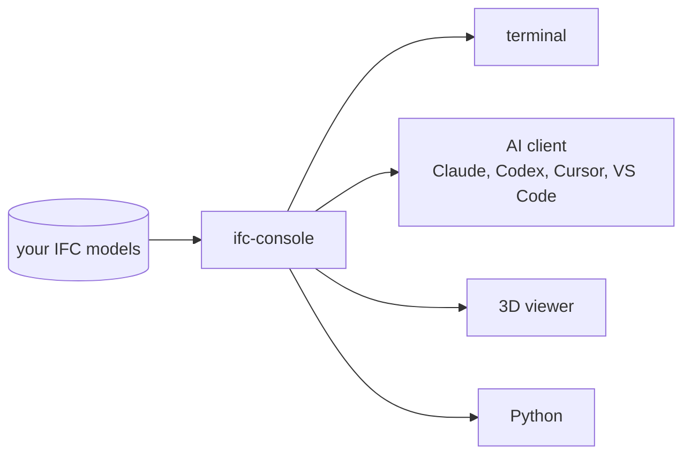

# Documentation

ifc-console loads your IFC models once and lets you work with them from
the terminal, an AI client, Python, or a 3D viewer. Start with the install, then
pick the surface you need.

## Your first session

Install the package, open a model, and connect the client you already use.
Ten minutes, no API key.

[Get started](getting-started.md){ .md-button .md-button--primary }
[How safety works](safety.md){ .md-button }

## Use it

-   **The console**

    The terminal: commands, keys, files, and the ask/edit switch.

    [Learn the console](console.md)

-   **Connect a client**

    Claude Code, Claude Desktop, Cursor, VS Code, and Codex.

    [Connect a client](clients.md)

-   **3D viewer**

    Select, section, measure, and let the AI see what you see.

    [Open the viewer](viewer.md)

-   **Agent workspace**

    Optional chat panel beside the viewer, with your own provider key.

    [Use the workspace](chat.md)

## Build with it

-   **Python SDK**

    Scripts, notebooks, CI, and your own agents on the same operations.

    [Use the SDK](sdk.md)

-   **Architecture**

    How one operation core serves every interface.

    [Read the architecture](architecture.md)

## Reference

| Page | What you will find |
| :--- | :--- |
| [MCP tools](tools.md) | Every tool by group, the response envelope, and error codes. |
| [CLI and settings](cli.md) | Subcommands, startup flags, and the settings that matter. |
| [Troubleshooting](troubleshooting.md) | Connection, port, viewer, and sandbox problems with fixes. |
| [Contributing](contributing.md) | Development setup, tests, and how to report a security issue. |
