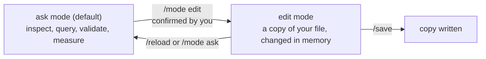
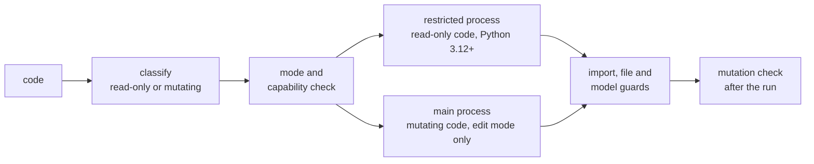

# Safety

ifc-console treats AI output and IFC text as untrusted. One rule sits above
everything else: **you, in the terminal, decide whether the model may change.**

## Ask and edit

| Action | `ask` | `edit` |
| :--- | :--- | :--- |
| inspect, validate, measure | allowed | allowed |
| preview a change | allowed | allowed |
| run model-changing code | blocked | allowed |
| AI tool writes the working copy | blocked | allowed |
| AI tool writes the file you opened | blocked | blocked by default |
| you run `/save` | allowed | allowed |

Switch with `/mode`. Moving to `edit` asks for confirmation, and no AI tool can
change the mode. Blocked operations return `ASK_MODE_BLOCKED` with a hint.

## Working copies

Entering edit mode copies the open file into `~/.ifc-console/working` and
points the session at that copy. Every save, reload, and download from then on
touches the copy. That is why an assistant may call `save_ifc_file` in edit
mode: the only file it can reach is the snapshot.

`/save <path>` writes anywhere you allow, including over the original.
`files.working_copy=false` restores in-place editing; then saving is yours
alone unless `files.allow_ai_save=true`.

## Generated code

`execute_ifc_code` runs Python against the model. Each run passes through:

- Ambiguous code is treated as mutating.
- Read-only code runs in a separate process with no network, no subprocesses,
  no credential environment, and a read allowlist for model folders.
- Mutating code must reach the live model, so it runs in the main process and
  only in edit mode.
- On Python 3.10 and 3.11 the restricted process is unavailable; `sandbox.mode=auto`
  falls back to guarded in-process execution and reports `sandboxed: false`.
  `strict` refuses the fallback.

The sandbox is a containment process, not a virtual machine. Treat edit mode
with untrusted prompts like running a script a stranger sent you.

## Files and audit

- **Allowed roots.** AI tools reach only the launch folder, the model folder,
  and directories you add with `--allow-dir` or `files.allowed_dirs`.
- **Safe replacement.** Every overwrite creates a timestamped backup, writes a
  temporary file, then replaces the target atomically.
- **Audit.** Calls, mode changes, mutations, and saves are logged under
  `~/.ifc-console/sessions/<id>/` with secret redaction and a hash chain.
  Inspect them with `/audit` or `ifc-console sessions show <id>`.

## Local server

- HTTP and WebSocket bind to `127.0.0.1` only.
- Session APIs need a bearer token; rotate it with `ifc-console token rotate`.
- Viewer tokens travel in the URL fragment and are removed from the address bar.
- The viewer can read the model and report your selection. It cannot edit the
  model or change the mode.

## Untrusted model text

Names, descriptions, and property values come from whoever wrote the IFC file
and may contain text aimed at an AI assistant. Ask mode stays read-only
whatever the text says, tool output that looks like instructions is flagged,
and every operation is visible in the feed. Review unfamiliar models in ask
mode.
