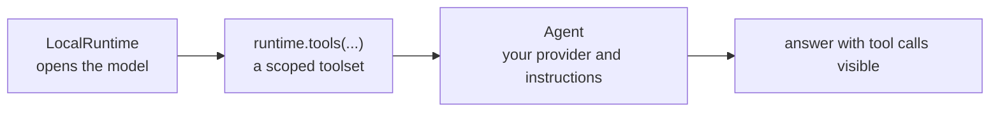

# Python SDK

The SDK ships in `ifc-console` and exposes the same operations as the MCP
tools. No server, terminal, or LLM is needed.

```bash
pip install ifc-console
```

| Interface | Use |
| :--- | :--- |
| `Workbench` | synchronous scripts, notebooks, and CI |
| `AsyncWorkbench` | the same API for async code |
| `LocalRuntime` | tools for an agent over a local model |
| `ConsoleRuntime` | tools connected to a running console |
| `Agent` | provider-neutral tool loop, from `ifc-console-agents` |

## Workbench

```python
from ifc_console import Workbench

with Workbench.open("tower.ifc") as wb:
    print(wb.info()["project"]["name"])
    walls = wb.query("IfcWall, Pset_WallCommon.IsExternal=TRUE")
    report = wb.validate()
    print(len(walls), report["valid"])
```

| Method | Result |
| :--- | :--- |
| `orient()` | status, project summary, and spatial tree |
| `info()` | schema, units, counts, and materials |
| `tree(depth=10)` | spatial containment tree |
| `search(term)` | matches on name, GlobalId, text, or selector |
| `query(selector)` | selector result rows |
| `element(ids)` / `psets(ids)` | element details or property sets |
| `quantities(selector, by="storey")` | aggregated quantities |
| `validate()` / `validate_ids(path)` | schema or IDS results |
| `clashes(set_a, set_b)` | overlaps and clearances |
| `call(name, **args)` | any operation, returning the raw `{ok, data, meta}` envelope |

Convenience methods raise `IfcConsoleError` with a stable `code` and `hint`:

```python
from ifc_console import IfcConsoleError

try:
    wb.query("IfcWall, ((broken")
except IfcConsoleError as exc:
    print(exc.code, exc.hint)
```

### Editing

`Workbench.open()` starts in `ask`. Pass `mode="edit"` to allow changes:

```python
with Workbench.open("tower.ifc", mode="edit") as wb:
    wb.run_code(
        'project = ifc.by_type("IfcProject")[0]\n'
        'ifc_api.attribute.edit_attributes('
        'ifc, product=project, attributes={"Name": "Tower"})',
        "rename the project",
    )
    wb.save()
```

### Several models

One model is active and writable; attached models are read-only:

```python
with Workbench.open("architecture.ifc") as wb:
    wb.attach("mep.ifc")
    hits = wb.clashes("IfcWall", "IfcDuctSegment", other_model="mep", tolerance=0.02)
```

## Agents



Install `ifc-console-agents` for the agent loop. The host keeps mode, settings,
credentials, and tool selection in its own code:

```python
from ifc_console import LocalRuntime
from ifc_console_agents import Agent, ProviderModel

async with await LocalRuntime.open("tower.ifc") as runtime:
    tools = await runtime.tools("query_elements", "get_element", "get_psets")
    agent = Agent(
        name="fire-review",
        model=ProviderModel(provider="anthropic", model="YOUR_MODEL_ID"),
        tools=tools,
        instructions="Use IFC tools for every factual model claim.",
    )
    answer = await agent.run("Which walls are missing a fire rating?")
    print(answer.text)
```

`runtime.tools()` accepts exact names or globs. Use `agent.stream()` for typed
events. `ConsoleRuntime` offers the same API against a running console, where
the user keeps the mode switch.

### LangChain

```python
from langchain.agents import create_agent
from ifc_console import LocalRuntime

async with await LocalRuntime.open("tower.ifc") as runtime:
    tools = await runtime.tools("get_ifc_project_info", "search_elements", "get_psets")
    agent = create_agent(
        model="openai:YOUR_MODEL_ID",
        tools=tools.as_langchain_tools(),
        system_prompt="Use IFC tools before making model claims.",
    )
```

## Batch workflows

For repeatable read-only checks over many files, describe the steps in a
manifest and run it from the CLI. No server or LLM is involved.

```yaml title="workflow.yaml"
version: "1"
name: submission-gate
inputs:
  - id: models
    paths: [models/*.ifc]
steps:
  - id: validate
    input_ids: [models]
    operation:
      kind: validation
      version: "1"
      ids_paths: [requirements/submission.ids]
  - id: external-walls
    input_ids: [models]
    needs: [validate]
    operation:
      kind: query
      version: "1"
      query: IfcWall, Pset_WallCommon.IsExternal=TRUE
      output_format: csv
```

```bash
ifc-console run workflow.yaml --plan      # validate and hash inputs, run nothing
ifc-console run workflow.yaml --output-dir reports
```

Exit code `5` means validation findings failed the gate. See
[CLI and settings](cli.md#automation).
