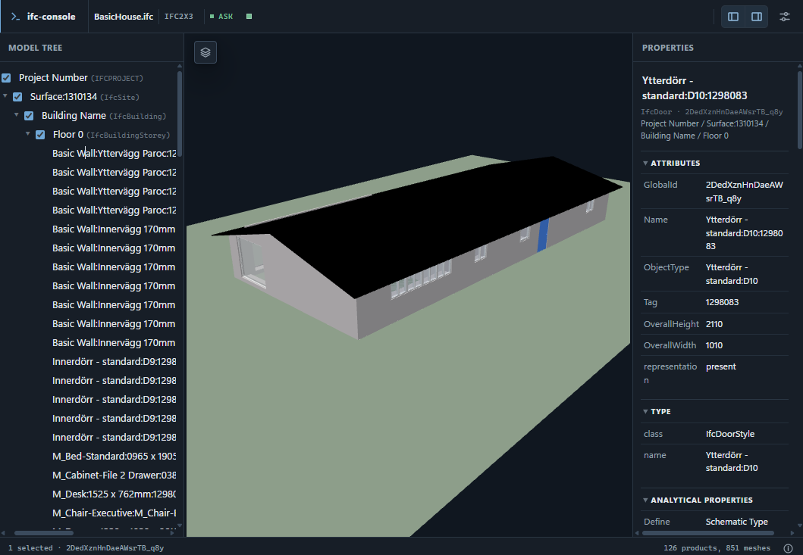
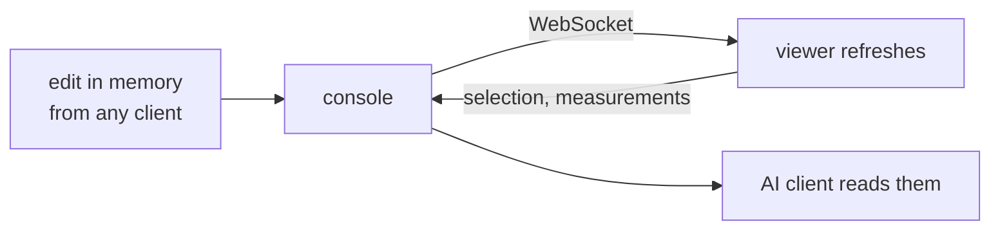

# 3D viewer

The viewer ships inside `ifc-console`, runs on localhost, and needs no LLM.
It shows geometry, properties, selections, highlights, and measurements, and
it refreshes itself whenever the model changes.

<figure markdown>
{ width="900" }
</figure>

## Open it

| Command | Use |
| :--- | :--- |
| `/viewer` | open the viewer in your browser |
| `/viewer vscode` | prepare a link for VS Code's built-in browser |
| `/copy viewer` | copy the viewer URL |
| `ifc-console --viewer` | enable it at startup |

The stdio server has no viewer. Use the console or `--no-tui`.

!!! tip "VS Code"
    Run `/viewer vscode` in VS Code's terminal, then Ctrl+click the link or
    paste it into **Browser: Open Integrated Browser**. Use the native
    Integrated Browser, not Simple Browser.

## Layout

```text
+-- IFC tabs --------------------------------- tools / settings --+
| spatial tree  | 3D canvas                            | properties |
| and search    |                                      | psets      |
+---------------+--------------------------------------+------------+
```

Search accepts plain text or IfcOpenShell selectors such as `IfcDoor` or
`Pset_WallCommon.FireRating=F30`. Results come from the live model,
including unsaved edits.

## Controls

| Action | Control |
| :--- | :--- |
| frame the model | ++f++ |
| select | click; ++ctrl++ + click for more |
| isolate or hide | ++i++ / ++h++ |
| transparent context | ++t++ |
| measure a length | ++m++, then two points |
| measure an angle | ++a++, then three points |
| measure an area | ++r++, click an outline, then ++enter++ |
| element size | ++alt++ + click |
| snap on or off | ++s++ |
| parallel projection | ++p++ |
| section | enable X, Y, or Z; drag the plane; set a slice to keep only a slab |
| undo a measure click | ++backspace++; ++escape++ leaves the mode |

Right-drag orbits, middle-drag pans, scroll zooms toward the cursor, and a
double-click frames the element you clicked. The help button in the viewer
lists everything.

Measurements snap to real corners, edges, and faces. Every result is in
metres in the model's own axes, and an AI client can read them back with
`get_viewer_measurements`.

## Live updates



The top bar shows a change count and two actions: **Save IFC** writes the
working copy, and **Download** hands you the model as it stands. Several tabs
can be open; each keeps its own camera and selection. With several models
attached, tabs switch between them.

## For AI clients

These tools are always in the MCP catalog, whether a tab is open or not:

| Tool | Use |
| :--- | :--- |
| `open_viewer` | turn the viewer on and open it in the browser |
| `get_viewer_selection` | what the user has selected, per model |
| `get_viewer_measurements` | everything measured so far |
| `highlight_elements` | color, isolate, and frame elements |
| `apply_color_theme` | paint labeled groups with a legend |
| `control_viewer` | views, camera, sections, focus, measurements, saved views |
| `get_viewer_screenshot` | an image of the current or a preset view |

A client that calls `open_viewer`, works the scene with `control_viewer`, and
finishes with `get_viewer_screenshot` can check its own work visually. The
viewer can read the model and report selections; it cannot edit the model or
change the mode.

## Limits

- `viewer.max_model_mb` defaults to 200 MB; large models need browser memory.
- Axis sections and slices are supported; arbitrary oblique cuts are not.
- Attached models show in separate tabs, not overlaid.

See [Troubleshooting](troubleshooting.md) for missing assets and
authorization errors.
